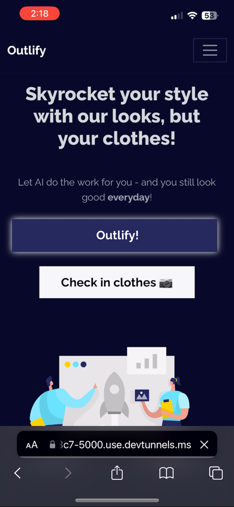
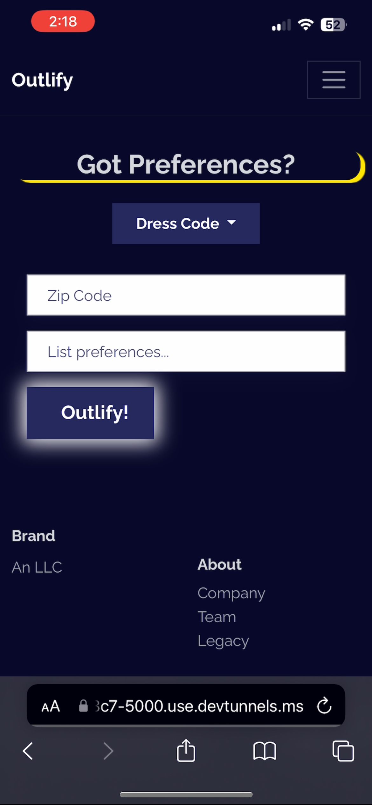
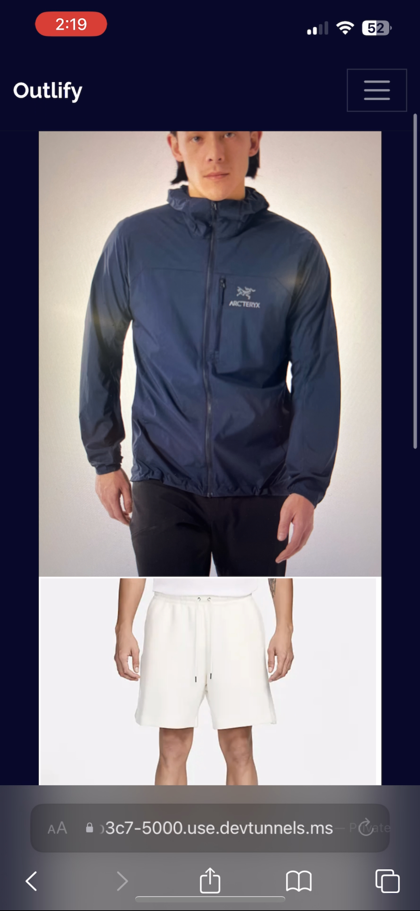
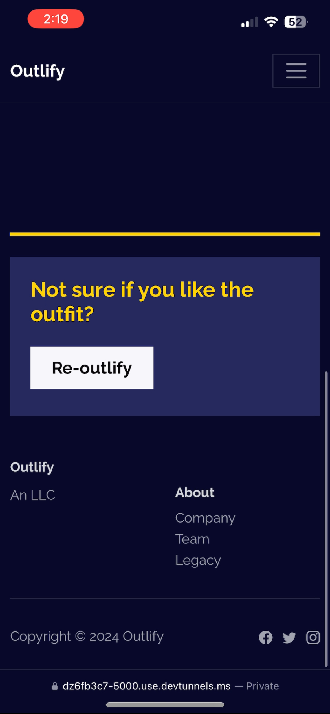

# Outlify

Outlify is an application designed to enhance your style by suggesting outfits from your personal wardrobe, powered by open-source multi-modal LLM technology.

## Project Structure

The project is organized as follows:

- `app.py`: The primary application file.
- `insert.py`: Logic for Supabase database operations.
- `hacker/`: Virtual environment containing all required packages. Activate using `source hacker/bin/activate`.
- `Images/`: Directory holding images utilized within the application.
- `static/`: Stores static files such as CSS and JavaScript for the web application.
- `templates/`: Holds HTML templates for the web application.

## Setup

To set up the project:

1. Clone the repository.
2. Download Ollama from [Ollama.com](https://ollama.com/).
3. Install the necessary Python packages using pip:

```sh
pip install -r requirements.txt
```

## Demos

### Login


## Home




## Preferences




## Outfit




## Re-outlify

